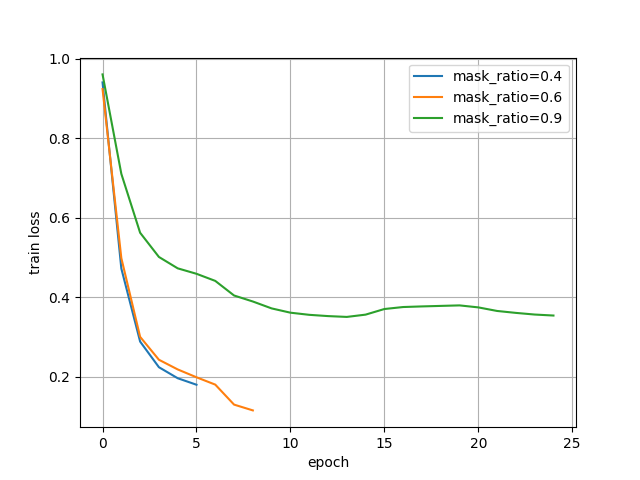
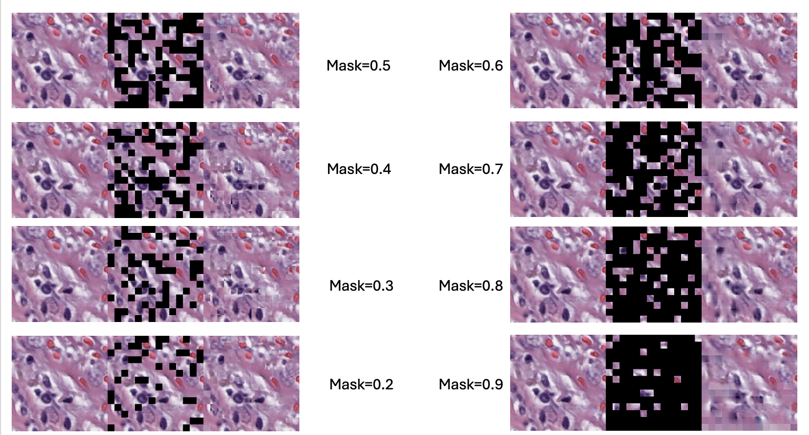
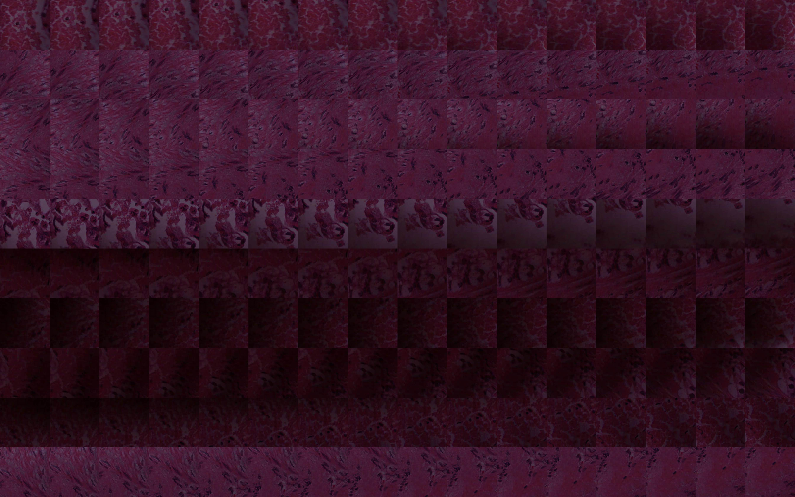
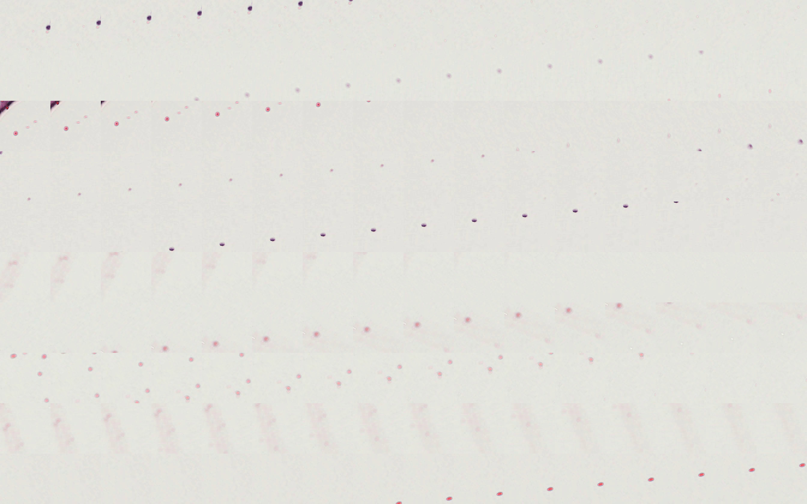
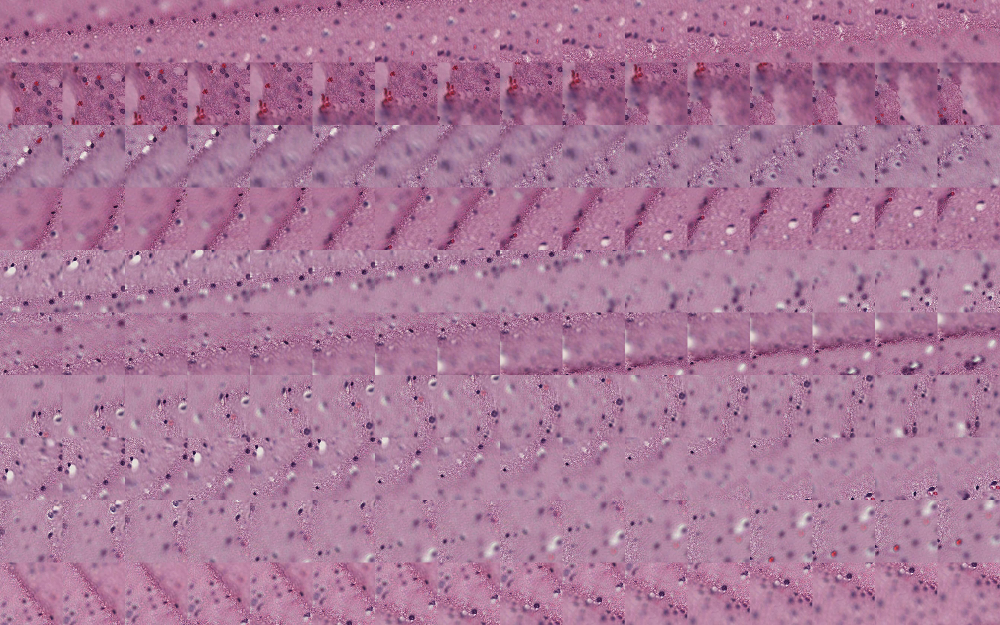
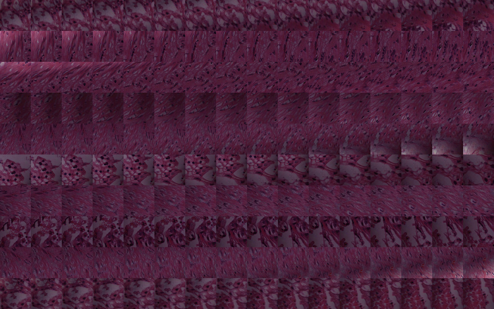
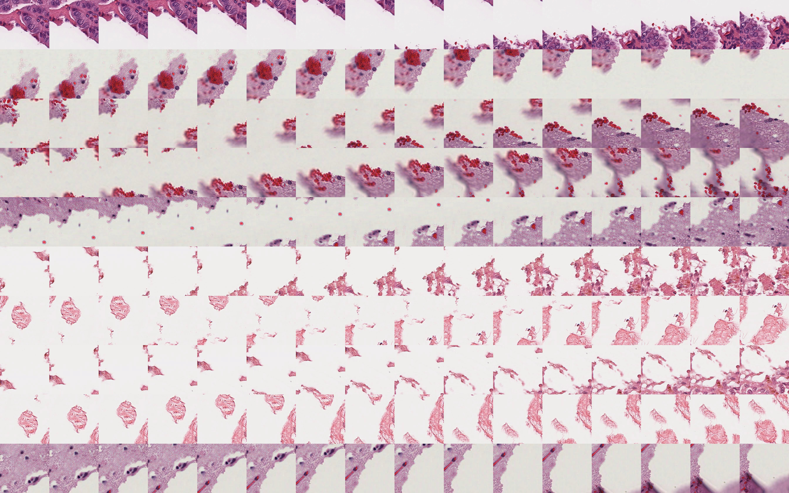
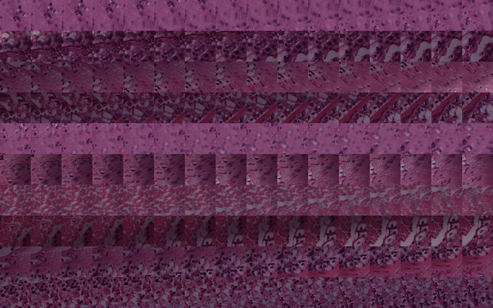

# Histopathology image sequence encoder for tumor microenvironment analysis

This work is an extension of our previously proposed HERE search engine for H\&E image analysis. In HERE, we primarily focused on patch-level image retrieval. However, the information contained in individual patches is limited, and there is a growing need to analyze larger contextual regions. To address this, we propose studying large-region content analysis in the tumor microenvironment by training a vision model on sequences of H\&E-stained images.

Our previous HERE repository: https://github.com/zhongzisha/HERE

PPT slides: https://docs.google.com/presentation/d/15SUqgRkCFNfKndkViBZqLZ4Dl2gC_kfI/edit?usp=drive_link&ouid=117999767196379466615&rtpof=true&sd=true

# Results

# Clustering results from image sequence features

We use a validation set consisting of 10,240 videos from 10 TCGA FFPE H&E whole slide images. 
Features are extracted from each video using an image sequence encoder.
Next, we apply k-means clustering to group the videos into 15 clusters.
For each cluster, we select the top 10 videos and extract 16 frames from each. 
These frames are illustrated below.

## Acknowledgement

This code builds upon the pioneering work of others and stands on the shoulders of giants.
We thank the authors of ImageMAE (https://github.com/facebookresearch/mae), VideoMAE (https://github.com/MCG-NJU/VideoMAE), and VideoMAEv2 (https://github.com/OpenGVLab/VideoMAEv2) for making their code available to the community.
If you find this repository useful, please consider citing their papers.

